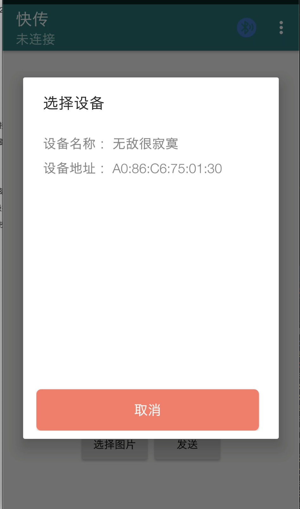
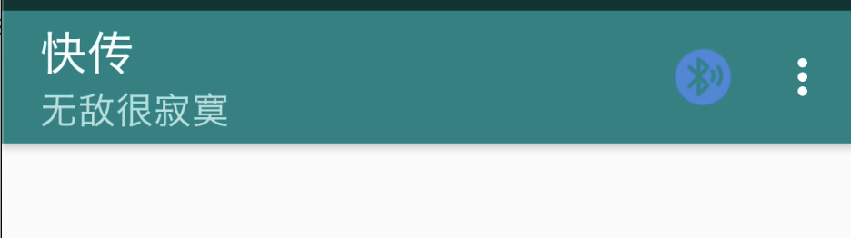
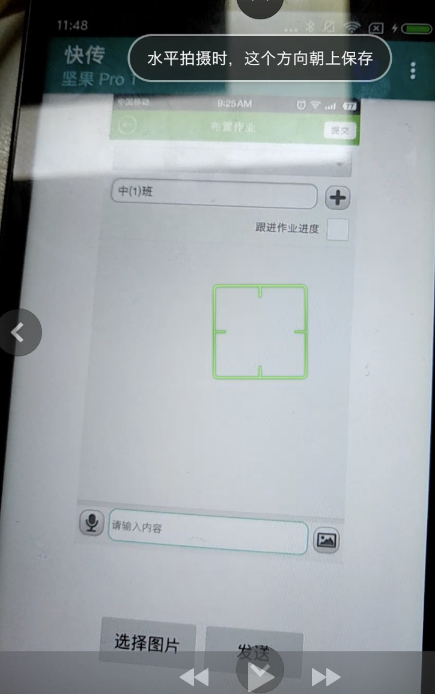
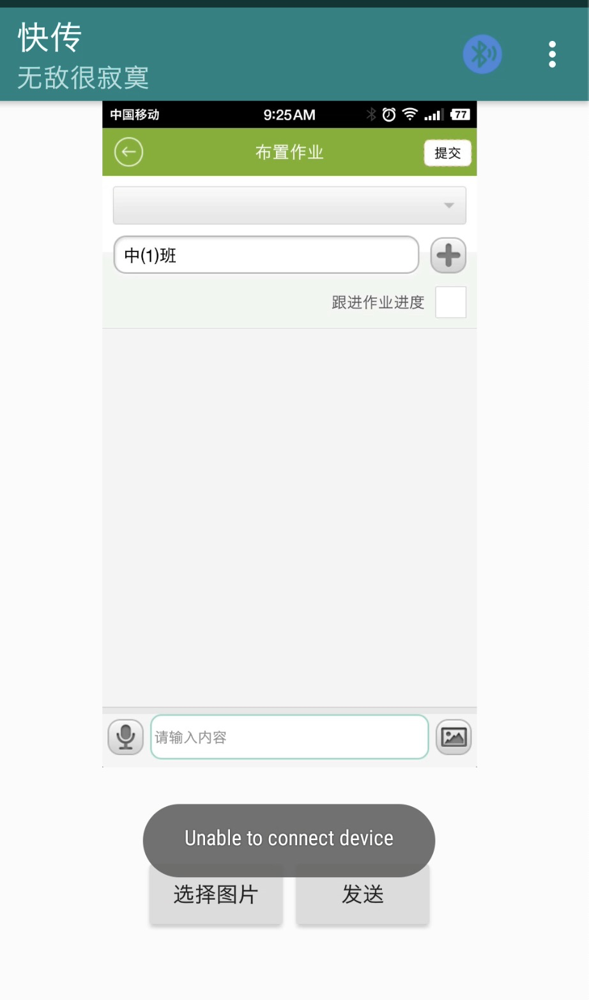

    另外我会提交一个新的的项目 通过蓝牙进行聊天，说到底还是通过 sokcet 

### 蓝牙
- 蓝牙基本设置
    1. 是否支持蓝牙
    2. 是否打开蓝牙
    3. 搜索蓝牙
        1. 已经配对的设备
        2. 搜索新设备
    4. 链接蓝牙

- 蓝牙通讯

---

#### 一、蓝牙基本设置

##### 1、是否支持蓝牙

      mBluetoothAdapter = BluetoothAdapter.getDefaultAdapter();
            if (mBluetoothAdapter == null) {
                showToast("不支持蓝牙");
                return;
            }

##### 2、是否打开蓝牙

       //isEnabled() ->true 打开
                     ->false 未打开
       if (mBluetoothAdapter != null) {
                if (!mBluetoothAdapter.isEnabled()) {

               }
         }

##### 3、搜索蓝牙

######  3.1 已经配对的设备

            if (mBluetoothAdapter != null) {
                        Set<BluetoothDevice> bondedDevices = mBluetoothAdapter.getBondedDevices();
                        for (BluetoothDevice device : bondedDevices) {
                               device.getName();
                               device.getAddress();
                        }
                    }

######  3.2 搜索新设备

            // mBluetoothAdapter.startDiscovery(); 通过这个方法取是搜索
            // 但是需要去动态注册一个 广播接收器来接收 获取到的信息
                private BroadcastReceiver mBroadcastReceiver = new BroadcastReceiver() {
                    @Override
                    public void onReceive(Context context, Intent intent) {
                        String action = intent.getAction();
                        if (TextUtils.isEmpty(action)) {
                            return;
                        }
                        if (TextUtils.equals(action, BluetoothDevice.ACTION_FOUND)) {
                            BluetoothDevice device = intent.getParcelableExtra(BluetoothDevice.EXTRA_DEVICE);
                            String address = device.getAddress();
                            String name = device.getName();
                            if (name == null) {
                                name = "null";
                            }
                            Log.e(TAG, "onReceive: name:" + name);
                            Log.e(TAG, "onReceive: address:" + address);
                            deviceList.add(new Device(device.getName(), device.getAddress()));
                            mRecyclerViewHelper.refresh(deviceList);

                        } else if (TextUtils.equals(action, BluetoothAdapter.ACTION_DISCOVERY_FINISHED)) {
                            showToast("扫描结束");
                        }
                    }
                };

                //BluetoothDevice.ACTION_FOUND                //发现新设备
                //BluetoothAdapter.ACTION_DISCOVERY_FINISHED  //扫描结束

                 IntentFilter intentFilter = new IntentFilter();
                        intentFilter.addAction(BluetoothDevice.ACTION_FOUND);
                        intentFilter.addAction(BluetoothAdapter.ACTION_DISCOVERY_FINISHED);
                        registerReceiver(mBroadcastReceiver, intentFilter);

#### 二、蓝牙通讯（链接、通讯）

###### 服务端
          - 安全链接 （需要两台设备同意后才进行链接） listenUsingRfcommWithServiceRecord
          - 不安全链接 （不需要） listenUsingInsecureRfcommWithServiceRecord
            BluetoothServerSocket tmp = null;
            mAdapter = bluetoothAdapter;
            mSocketType = secure ? "Secure" : "Insecure";
            this.mListener = listener;
            try {
                if (secure) {
                    tmp = mAdapter.listenUsingRfcommWithServiceRecord(Common.NAME_SECURE,
                            Common.MY_UUID_SECURE);
                } else {
                    tmp = mAdapter.listenUsingInsecureRfcommWithServiceRecord(
                            Common.NAME_INSECURE, Common.MY_UUID_INSECURE);
                }
                //

// 选这样。晚点在补充

- 选择设备

- 链接设备成功

- 选择图片后发送，另外手机接收

- 断开链接

----
----

## 顺便记下markDown语法

    有几个#就是有多少级标题
#### 我是四级
###### 我是六级

----
##### 字体样式

     一个 *    |   *这是倾斜的文字*`
     两个 **   |   **这是加粗的文字**
     三个 ***  |   ***这是斜体加粗的文字***
     两个 ～～  | ~~这是加删除线的文字~~
----

##### 饮用

     一个 >    |   *这是倾斜的文字*`
     两个 >>   |   **这是加粗的文字**

效果
> 1
>>2
>>>3
----

##### 图片

    

    图片alt就是显示在图片下面的文字，相当于对图片内容的解释。
    图片title是图片的标题，当鼠标移到图片上时显示的内容。title可加可不加

    

